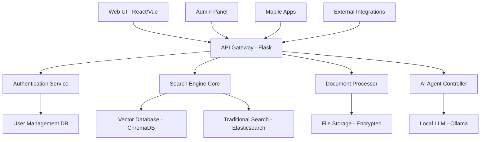

# DeepSearch Defense Industry - Technical Specifications
## Detaylı Teknik Mimari ve Resource Requirements
### Tarih: 29 Eylül 2025

---

# 🏗️ SYSTEM ARCHITECTURE OVERVIEW

## **High-Level Architecture**


## **Security Layer Architecture**
```
┌─────────────────────────────────────────────────────────────┐
│                     SECURITY PERIMETER                     │
├─────────────────────────────────────────────────────────────┤
│ Authentication: Multi-Factor, SSO, Session Management      │
│ Authorization: RBAC, Document Classification, ACL         │  
│ Audit: Complete logging, Real-time monitoring             │
│ Encryption: AES-256 at rest, TLS 1.3 in transit         │
│ Network: Air-gapped deployment, VPN access only           │
└─────────────────────────────────────────────────────────────┘
```

---

# 🔐 PHASE 1: SECURITY & COMPLIANCE - Technical Specs

## **1.1 Authentication & Authorization System**

### **Database Schema**
```sql
-- User Management Tables
CREATE TABLE users (
    id SERIAL PRIMARY KEY,
    username VARCHAR(50) UNIQUE NOT NULL,
    email VARCHAR(100) UNIQUE NOT NULL,
    password_hash VARCHAR(255) NOT NULL,
    clearance_level INTEGER DEFAULT 0,
    department_id INTEGER REFERENCES departments(id),
    is_active BOOLEAN DEFAULT true,
    last_login TIMESTAMP,
    created_at TIMESTAMP DEFAULT NOW(),
    updated_at TIMESTAMP DEFAULT NOW()
);

CREATE TABLE departments (
    id SERIAL PRIMARY KEY,
    name VARCHAR(100) NOT NULL,
    code VARCHAR(20) UNIQUE,
    classification_level INTEGER DEFAULT 0,
    parent_department_id INTEGER REFERENCES departments(id)
);

CREATE TABLE user_roles (
    id SERIAL PRIMARY KEY,
    user_id INTEGER REFERENCES users(id),
    role_name VARCHAR(50) NOT NULL,
    granted_by INTEGER REFERENCES users(id),
    granted_at TIMESTAMP DEFAULT NOW(),
    expires_at TIMESTAMP,
    is_active BOOLEAN DEFAULT true
);

-- Document Security Tables
CREATE TABLE document_classifications (
    id SERIAL PRIMARY KEY,
    document_path VARCHAR(500) NOT NULL,
    classification_level INTEGER NOT NULL, -- 0=Public, 1=Confidential, 2=Secret, 3=Top Secret
    classified_by INTEGER REFERENCES users(id),
    classification_date TIMESTAMP DEFAULT NOW(),
    review_date TIMESTAMP,
    department_restrictions INTEGER[] -- Array of allowed department IDs
);

-- Audit Trail
CREATE TABLE access_logs (
    id SERIAL PRIMARY KEY,
    user_id INTEGER REFERENCES users(id),
    action VARCHAR(100) NOT NULL, -- 'search', 'view', 'download', 'classify'
    resource_type VARCHAR(50), -- 'document', 'search_result', 'admin_panel'
    resource_id VARCHAR(200),
    ip_address INET,
    user_agent TEXT,
    timestamp TIMESTAMP DEFAULT NOW(),
    success BOOLEAN DEFAULT true,
    error_message TEXT
);
```

### **Security Middleware Implementation**
```python
class SecurityMiddleware:
    def __init__(self, app):
        self.app = app
        
    def __call__(self, environ, start_response):
        # Request authentication
        user = self.authenticate_request(environ)
        if not user:
            return self.unauthorized_response(start_response)
            
        # Authorization check
        if not self.authorize_request(user, environ):
            return self.forbidden_response(start_response)
            
        # Audit logging
        self.log_access(user, environ)
        
        return self.app(environ, start_response)
    
    def authenticate_request(self, environ):
        """Multi-factor authentication"""
        token = self.extract_token(environ)
        session = self.validate_session(token)
        user = self.get_user_from_session(session)
        
        # Check if 2FA required
        if self.requires_2fa(user) and not self.verify_2fa(environ):
            return None
            
        return user
    
    def authorize_request(self, user, environ):
        """Role-based access control"""
        requested_resource = self.parse_resource(environ)
        required_clearance = self.get_required_clearance(requested_resource)
        
        return user.clearance_level >= required_clearance

class DocumentSecurityService:
    def classify_document(self, file_path, classification_level, user):
        """Auto/manual document classification"""
        # Content analysis for sensitive data
        content = self.extract_text(file_path)
        auto_classification = self.analyze_content_sensitivity(content)
        
        # Use higher of manual or auto classification
        final_classification = max(classification_level, auto_classification)
        
        # Store in database
        self.db.execute("""
            INSERT INTO document_classifications 
            (document_path, classification_level, classified_by)
            VALUES (%s, %s, %s)
        """, (file_path, final_classification, user.id))
        
        return final_classification
    
    def check_document_access(self, user, document_path):
        """Verify user can access document"""
        doc_classification = self.get_document_classification(document_path)
        
        # Check clearance level
        if user.clearance_level < doc_classification.level:
            return False
            
        # Check department restrictions
        if doc_classification.department_restrictions:
            if user.department_id not in doc_classification.department_restrictions:
                return False
                
        return True

class EncryptionService:
    def __init__(self):
        self.cipher_suite = Fernet(self.load_encryption_key())
    
    def encrypt_file(self, file_path):
        """Encrypt file at rest with AES-256"""
        with open(file_path, 'rb') as f:
            file_data = f.read()
            
        encrypted_data = self.cipher_suite.encrypt(file_data)
        
        # Store encrypted version
        encrypted_path = f"{file_path}.encrypted"
        with open(encrypted_path, 'wb') as f:
            f.write(encrypted_data)
            
        # Remove original
        os.remove(file_path)
        
        return encrypted_path
    
    def decrypt_file(self, encrypted_path, user):
        """Decrypt file for authorized user"""
        if not self.authorize_decryption(user, encrypted_path):
            raise UnauthorizedAccess("User not authorized to decrypt file")
            
        with open(encrypted_path, 'rb') as f:
            encrypted_data = f.read()
            
        decrypted_data = self.cipher_suite.decrypt(encrypted_data)
        return decrypted_data
```

### **Hardware Requirements - Phase 1**
```yaml
Development Environment:
  CPU: Intel i7-12700K or AMD Ryzen 7 5800X
  RAM: 32GB DDR4
  Storage: 1TB NVMe SSD
  Network: Gigabit Ethernet
  Security: Hardware Security Module (HSM) for key storage

Production Environment:
  Servers: 2x Redundant servers
  CPU: Intel Xeon Gold 6248R (24 cores) or AMD EPYC 7402P
  RAM: 128GB DDR4 ECC
  Storage: 4TB NVMe SSD RAID 1
  Network: 10Gb Ethernet, Isolated network segment
  Backup: Dedicated backup server with 20TB capacity
  Security: Hardware HSM, Secure boot, TPM 2.0
```

---

# 🤖 PHASE 2: AI & LLM INTEGRATION - Technical Specs

## **2.1 Offline LLM Infrastructure**

### **LLM Model Architecture**
```python
class OfflineLLMService:
    def __init__(self):
        self.models = {
            'llama2_7b': self.load_model('llama2:7b-chat'),
            'mistral_7b': self.load_model('mistral:7b-instruct'),
            'code_llama': self.load_model('codellama:7b-instruct'),
            'turkish_bert': self.load_model('dbmdz/bert-base-turkish-cased')
        }
        self.embedding_model = SentenceTransformer(
            'sentence-transformers/paraphrase-multilingual-mpnet-base-v2'
        )
        
    def generate_response(self, query, context_docs, user_clearance):
        """Generate response with security context"""
        # Filter documents by clearance
        accessible_docs = self.filter_by_clearance(context_docs, user_clearance)
        
        # Build prompt with security context
        prompt = self.build_secure_prompt(query, accessible_docs)
        
        # Generate response
        response = self.models['llama2_7b'].generate(
            prompt,
            max_tokens=512,
            temperature=0.7,
            stop_sequences=['[CLASSIFIED]', '[RESTRICTED]']
        )
        
        # Post-process for security
        sanitized_response = self.sanitize_response(response, user_clearance)
        
        return sanitized_response
    
    def build_secure_prompt(self, query, docs):
        """Build prompt with classification awareness"""
        prompt = f"""
        You are a defense industry document assistant. 
        User Query: {query}
        
        Available Documents (filtered by security clearance):
        """
        
        for doc in docs:
            classification = self.get_classification_label(doc.classification)
            prompt += f"\n[{classification}] {doc.title}: {doc.content[:500]}..."
            
        prompt += """
        
        Instructions:
        1. Only use information from the provided documents
        2. Indicate classification level of information used
        3. Do not speculate beyond available documents
        4. If information is classified above user level, state "Information classified"
        
        Response:
        """
        
        return prompt

class ConversationalAgent:
    def __init__(self, llm_service):
        self.llm = llm_service
        self.conversation_memory = {}
        
    def process_conversation_turn(self, user_id, query, session_id):
        """Handle multi-turn conversations"""
        # Get conversation history
        history = self.conversation_memory.get(session_id, [])
        
        # Check if query needs clarification
        if self.needs_clarification(query):
            clarification = self.generate_clarification_question(query, history)
            return {
                'type': 'clarification',
                'message': clarification,
                'requires_response': True
            }
            
        # Process query with context
        context_docs = self.retrieve_relevant_docs(query, user_id)
        response = self.llm.generate_response(query, context_docs, user_id)
        
        # Update conversation history
        history.append({'query': query, 'response': response, 'timestamp': time.time()})
        self.conversation_memory[session_id] = history[-10:]  # Keep last 10 turns
        
        return {
            'type': 'response',
            'message': response,
            'sources': [doc.path for doc in context_docs],
            'requires_response': False
        }
    
    def needs_clarification(self, query):
        """Determine if query is too ambiguous"""
        # Use NLP to detect ambiguous queries
        ambiguity_score = self.calculate_ambiguity(query)
        return ambiguity_score > 0.7
        
    def generate_clarification_question(self, query, history):
        """Generate follow-up questions"""
        clarification_prompt = f"""
        User asked: "{query}"
        
        This query is ambiguous. Generate 2-3 specific follow-up questions to clarify:
        - Time period (if relevant)
        - Specific system/component
        - Classification level needed
        - Department context
        
        Questions:
        """
        
        return self.llm.models['llama2_7b'].generate(clarification_prompt)
```

### **AI Agent Architecture**
```python
class DefenseSearchAgentSystem:
    def __init__(self):
        self.agents = {
            'document_analyzer': DocumentAnalysisAgent(),
            'security_classifier': SecurityClassificationAgent(),
            'report_generator': ReportGenerationAgent(),
            'fact_checker': FactVerificationAgent(),
            'query_planner': QueryPlanningAgent()
        }
        self.orchestrator = AgentOrchestrator(self.agents)
    
    def process_complex_query(self, query, user):
        """Multi-agent query processing"""
        # Plan query execution
        execution_plan = self.agents['query_planner'].plan(query)
        
        results = []
        for step in execution_plan.steps:
            agent = self.agents[step.agent_type]
            step_result = agent.execute(step.action, step.parameters)
            results.append(step_result)
            
        # Combine results
        final_result = self.orchestrator.combine_results(results)
        
        # Generate comprehensive report
        report = self.agents['report_generator'].generate_report(
            query, final_result, user.clearance_level
        )
        
        return report

class DocumentAnalysisAgent:
    def __init__(self):
        self.nlp = spacy.load("en_core_web_sm")
        
    def analyze_document_structure(self, doc_content):
        """Analyze document for key information"""
        analysis = {
            'summary': self.generate_summary(doc_content),
            'key_topics': self.extract_topics(doc_content),
            'technical_specs': self.extract_technical_data(doc_content),
            'references': self.extract_references(doc_content),
            'classification_indicators': self.detect_classification_markers(doc_content)
        }
        return analysis
    
    def extract_technical_data(self, content):
        """Extract technical specifications and data"""
        # Pattern matching for technical data
        patterns = {
            'dimensions': r'(\d+\.?\d*)\s*(mm|cm|m|inches?|ft)',
            'weights': r'(\d+\.?\d*)\s*(kg|g|lbs?|tons?)',
            'speeds': r'(\d+\.?\d*)\s*(km/h|mph|m/s|knots)',
            'ranges': r'(\d+\.?\d*)\s*(km|miles|nm)',
            'temperatures': r'(\d+\.?\d*)\s*°?(C|F|K)'
        }
        
        technical_data = {}
        for category, pattern in patterns.items():
            matches = re.findall(pattern, content, re.IGNORECASE)
            if matches:
                technical_data[category] = matches
                
        return technical_data

class SecurityClassificationAgent:
    def __init__(self):
        self.classification_model = self.load_classification_model()
        
    def auto_classify_document(self, content, metadata):
        """Automatically classify document security level"""
        # Check for explicit classification markers
        explicit_classification = self.check_explicit_markers(content)
        if explicit_classification:
            return explicit_classification
            
        # Content-based classification
        sensitivity_score = self.calculate_sensitivity_score(content)
        
        # Metadata-based classification
        metadata_score = self.analyze_metadata_sensitivity(metadata)
        
        # Combine scores
        final_score = max(sensitivity_score, metadata_score)
        
        return self.score_to_classification(final_score)
    
    def calculate_sensitivity_score(self, content):
        """Calculate content sensitivity using ML model"""
        features = self.extract_features(content)
        sensitivity_score = self.classification_model.predict_proba([features])[0]
        return sensitivity_score
        
    def extract_features(self, content):
        """Extract features for classification"""
        features = []
        
        # Keyword-based features
        sensitive_keywords = ['classified', 'secret', 'confidential', 'restricted',
                            'nato', 'military', 'defense', 'weapon', 'missile']
        for keyword in sensitive_keywords:
            features.append(content.lower().count(keyword))
            
        # Technical complexity features  
        technical_patterns = [r'\b[A-Z]{2,}-\d+\b',  # Technical codes
                            r'\d+\.\d+\s*(MHz|GHz|nm)',  # Technical specs
                            r'[A-Z][a-z]+\s+[A-Z]\d+']  # Equipment codes
        for pattern in technical_patterns:
            features.append(len(re.findall(pattern, content)))
            
        return features
```

### **Hardware Requirements - Phase 2**
```yaml
AI/ML Infrastructure:
  GPU Server:
    GPU: 2x NVIDIA RTX 4090 or 1x A100 (40GB)
    CPU: Intel i9-13900KS or AMD Ryzen 9 7950X
    RAM: 128GB DDR5
    Storage: 4TB NVMe SSD
    Network: 10Gb Ethernet
    
  Model Storage:
    LLM Models: ~100GB (Llama2, Mistral, Code Llama)
    Embedding Models: ~10GB
    Training Data: ~500GB
    Cache Storage: ~1TB
    
  Performance Requirements:
    LLM Inference: < 2 seconds per query
    Embedding Generation: < 100ms per document
    Concurrent Model Serving: 10+ users
    Memory Usage: < 80GB peak usage
```

---

# 📈 PHASE 3: ENTERPRISE SCALABILITY - Technical Specs

## **3.1 Vector Database Architecture**

### **ChromaDB Enterprise Setup**
```python
class EnterpriseVectorDatabase:
    def __init__(self):
        # Persistent client with enterprise features
        self.client = chromadb.PersistentClient(
            path="./enterprise_chroma_db",
            settings=chromadb.config.Settings(
                chroma_db_impl="duckdb+parquet",
                persist_directory="./enterprise_chroma_db",
                anonymized_telemetry=False
            )
        )
        
        # Collections for different classification levels
        self.collections = {
            'unclassified': self.create_collection('unclassified', 0),
            'confidential': self.create_collection('confidential', 1),
            'secret': self.create_collection('secret', 2),
            'top_secret': self.create_collection('top_secret', 3)
        }
        
    def create_collection(self, name, classification_level):
        """Create collection with classification metadata"""
        return self.client.create_collection(
            name=name,
            metadata={
                "classification_level": classification_level,
                "created_at": datetime.now().isoformat(),
                "encryption_enabled": classification_level > 0,
                "audit_required": True
            },
            embedding_function=self.get_embedding_function()
        )
    
    def secure_search(self, query, user_clearance, filters=None):
        """Search with security context"""
        accessible_collections = self.get_accessible_collections(user_clearance)
        
        all_results = []
        for collection_name in accessible_collections:
            collection = self.collections[collection_name]
            
            # Add user context to metadata filter
            search_filters = filters or {}
            search_filters['user_clearance'] = user_clearance
            
            results = collection.query(
                query_texts=[query],
                n_results=10,
                where=search_filters,
                include=['documents', 'metadatas', 'distances']
            )
            
            all_results.extend(self.format_results(results, collection_name))
        
        # Sort by relevance and apply final filtering
        return self.rank_and_filter_results(all_results, user_clearance)

class HybridSearchEngine:
    def __init__(self):
        self.vector_db = EnterpriseVectorDatabase()
        self.traditional_search = ElasticsearchClient()
        self.hybrid_ranker = HybridRanker()
        
    def hybrid_search(self, query, user, vector_weight=0.7):
        """Combine vector and traditional search"""
        # Vector search
        vector_results = self.vector_db.secure_search(query, user.clearance_level)
        
        # Traditional keyword search  
        keyword_results = self.traditional_search.search(
            query, 
            filters={'clearance_level': {'lte': user.clearance_level}}
        )
        
        # Combine and re-rank
        hybrid_results = self.hybrid_ranker.combine_results(
            vector_results, keyword_results, vector_weight
        )
        
        return hybrid_results

class PerformanceOptimizer:
    def __init__(self):
        self.cache = redis.Redis(host='localhost', port=6379, db=0)
        self.query_analyzer = QueryAnalyzer()
        
    def optimize_query(self, query, user):
        """Optimize query performance"""
        # Check cache first
        cache_key = self.generate_cache_key(query, user.clearance_level)
        cached_result = self.cache.get(cache_key)
        
        if cached_result:
            return json.loads(cached_result)
            
        # Analyze query complexity
        complexity = self.query_analyzer.analyze(query)
        
        # Choose optimal search strategy
        if complexity.is_simple:
            results = self.simple_vector_search(query, user)
        elif complexity.is_complex:
            results = self.agent_based_search(query, user)
        else:
            results = self.hybrid_search(query, user)
            
        # Cache results
        self.cache.setex(cache_key, 3600, json.dumps(results))
        
        return results
```

### **Performance Monitoring System**
```python
class PerformanceMonitor:
    def __init__(self):
        self.metrics_collector = MetricsCollector()
        self.alerting_system = AlertingSystem()
        
    @monitor_performance
    def track_search_performance(self, query, user, start_time):
        """Track search performance metrics"""
        end_time = time.time()
        response_time = end_time - start_time
        
        metrics = {
            'response_time': response_time,
            'query_complexity': self.calculate_complexity(query),
            'result_count': len(results),
            'user_clearance': user.clearance_level,
            'timestamp': datetime.now().isoformat()
        }
        
        self.metrics_collector.record(metrics)
        
        # Check performance thresholds
        if response_time > 1.0:  # 1 second threshold
            self.alerting_system.alert(
                'SLOW_QUERY',
                f'Query took {response_time:.2f}s: {query[:100]}'
            )

class ScalabilityTester:
    def __init__(self):
        self.load_generator = LoadGenerator()
        self.performance_monitor = PerformanceMonitor()
        
    def run_scale_test(self, target_documents=10000, concurrent_users=100):
        """Run comprehensive scale testing"""
        # Document loading test
        self.test_document_loading(target_documents)
        
        # Concurrent user test
        self.test_concurrent_users(concurrent_users)
        
        # Memory usage test
        self.test_memory_usage()
        
        # Long-running stability test
        self.test_stability(duration_hours=24)
        
    def test_document_loading(self, document_count):
        """Test system with large document set"""
        print(f"Loading {document_count} documents...")
        
        start_time = time.time()
        for i in range(document_count):
            # Generate test document
            doc = self.generate_test_document(i)
            self.vector_db.add_document(doc)
            
            if i % 1000 == 0:
                elapsed = time.time() - start_time
                rate = i / elapsed if elapsed > 0 else 0
                print(f"Loaded {i} documents ({rate:.1f} docs/sec)")
                
        total_time = time.time() - start_time
        print(f"Completed loading {document_count} documents in {total_time:.1f} seconds")
```

### **Hardware Requirements - Phase 3**
```yaml
Production Infrastructure:
  Database Server:
    CPU: 2x Intel Xeon Gold 6248R (48 cores total)
    RAM: 512GB DDR4 ECC
    Storage: 
      - Primary: 8TB NVMe SSD RAID 10
      - Backup: 20TB HDD RAID 6
    Network: 2x 10Gb Ethernet (bonded)
    
  Search Server Cluster:
    Nodes: 3x identical servers
    CPU: Intel Xeon Silver 4314 (16 cores each)
    RAM: 256GB DDR4 ECC each
    Storage: 4TB NVMe SSD each
    Network: 10Gb Ethernet
    
  Cache/Redis Server:
    CPU: Intel i7-12700K
    RAM: 64GB DDR4
    Storage: 2TB NVMe SSD
    Network: Gigabit Ethernet
    
  Load Balancer:
    Hardware: Dedicated load balancer appliance
    Throughput: 10Gb/s
    Concurrent Connections: 100,000+
    SSL Termination: Hardware accelerated
```

---

# 🌐 PHASE 4: INTEGRATION & DEPLOYMENT - Technical Specs

## **4.1 System Integration Architecture**

### **Enterprise Directory Integration**
```python
class ActiveDirectoryIntegration:
    def __init__(self):
        self.ldap_connection = self.setup_ldap_connection()
        self.user_mapper = UserAttributeMapper()
        
    def sync_users_from_ad(self):
        """Sync users from Active Directory"""
        ad_users = self.ldap_connection.search_ext_s(
            base='DC=company,DC=com',
            scope=ldap.SCOPE_SUBTREE,
            filterstr='(&(objectClass=user)(objectCategory=person))',
            attrlist=['sAMAccountName', 'displayName', 'mail', 'department', 
                     'title', 'memberOf']
        )
        
        for dn, attrs in ad_users:
            user_data = self.user_mapper.map_ad_attributes(attrs)
            
            # Determine clearance level based on AD groups
            clearance_level = self.determine_clearance_from_groups(
                attrs.get('memberOf', [])
            )
            
            # Create or update user
            self.create_or_update_user(user_data, clearance_level)
            
    def determine_clearance_from_groups(self, groups):
        """Map AD groups to clearance levels"""
        group_clearance_mapping = {
            'CN=TopSecret,OU=Security,DC=company,DC=com': 3,
            'CN=Secret,OU=Security,DC=company,DC=com': 2,
            'CN=Confidential,OU=Security,DC=company,DC=com': 1,
            'CN=Employees,OU=Users,DC=company,DC=com': 0
        }
        
        max_clearance = 0
        for group in groups:
            if group in group_clearance_mapping:
                max_clearance = max(max_clearance, group_clearance_mapping[group])
                
        return max_clearance

class SharePointIntegration:
    def __init__(self):
        self.sp_client = self.setup_sharepoint_client()
        self.document_processor = DocumentProcessor()
        
    def sync_sharepoint_documents(self, site_url, document_library):
        """Sync documents from SharePoint"""
        documents = self.sp_client.get_documents(site_url, document_library)
        
        for doc in documents:
            # Download document
            content = self.sp_client.download_file(doc.server_relative_url)
            
            # Extract metadata
            metadata = {
                'source': 'sharepoint',
                'site_url': site_url,
                'library': document_library,
                'author': doc.author,
                'created': doc.created,
                'modified': doc.modified,
                'version': doc.version
            }
            
            # Process and index document
            self.process_and_index_document(content, metadata)
            
    def setup_sharepoint_client(self):
        """Setup SharePoint client with authentication"""
        from office365.runtime.auth.authentication_context import AuthenticationContext
        from office365.sharepoint.client_context import ClientContext
        
        auth_context = AuthenticationContext(self.sharepoint_url)
        auth_context.acquire_token_for_user(self.username, self.password)
        
        return ClientContext(self.sharepoint_url, auth_context)

class OfficeIntegration:
    def __init__(self):
        self.graph_client = self.setup_graph_client()
        
    def integrate_with_teams(self):
        """Integrate with Microsoft Teams"""
        # Create Teams app/bot for document search
        teams_app = {
            'app_id': self.teams_app_id,
            'bot_endpoint': f'{self.base_url}/api/teams/bot',
            'commands': [
                {
                    'command': 'search',
                    'description': 'Search documents',
                    'help': '/search [query] - Search for documents'
                },
                {
                    'command': 'classify',
                    'description': 'Classify document',
                    'help': '/classify [document_url] - Auto-classify document'
                }
            ]
        }
        
        return teams_app
        
    def handle_teams_command(self, command, parameters, user):
        """Handle Teams bot commands"""
        if command == 'search':
            results = self.search_service.search(parameters['query'], user)
            return self.format_teams_response(results)
        elif command == 'classify':
            classification = self.classify_document(parameters['document_url'])
            return f"Document classified as: {classification}"
```

### **Modern Web Application Architecture**
```typescript
// Frontend Architecture - React/TypeScript
interface DefenseSearchApp {
  components: {
    SearchInterface: React.Component;
    ResultsDisplay: React.Component;
    DocumentViewer: React.Component;
    AdminPanel: React.Component;
    ClassificationBadge: React.Component;
  };
  
  services: {
    AuthService: AuthenticationService;
    SearchService: SearchAPIService;
    DocumentService: DocumentAPIService;
    SecurityService: SecurityAPIService;
  };
  
  state: {
    user: UserProfile;
    searchResults: SearchResult[];
    currentDocument: Document;
    securityContext: SecurityContext;
  };
}

// Progressive Web App Configuration
const pwaConfig = {
  name: 'DeepSearch Defense',
  short_name: 'DeepSearch',
  description: 'Defense Industry Document Search Platform',
  start_url: '/',
  display: 'standalone',
  background_color: '#1a1a1a',
  theme_color: '#2563eb',
  icons: [
    {
      src: '/icons/icon-192x192.png',
      sizes: '192x192',
      type: 'image/png'
    }
  ],
  offline_fallback: '/offline.html'
};

// Real-time Updates with WebSocket
class RealtimeUpdates {
  private ws: WebSocket;
  
  connect() {
    this.ws = new WebSocket(`wss://${window.location.host}/ws`);
    
    this.ws.onmessage = (event) => {
      const update = JSON.parse(event.data);
      
      switch (update.type) {
        case 'new_document':
          this.handleNewDocument(update.data);
          break;
        case 'classification_change':
          this.handleClassificationChange(update.data);
          break;
        case 'security_alert':
          this.handleSecurityAlert(update.data);
          break;
      }
    };
  }
  
  private handleSecurityAlert(alert: SecurityAlert) {
    // Show security notification
    if (alert.severity === 'HIGH') {
      this.showImmediateAlert(alert.message);
    } else {
      this.addToNotificationQueue(alert);
    }
  }
}
```

### **Production Deployment Configuration**
```dockerfile
# Multi-stage Dockerfile for production
FROM python:3.11-slim as base

# Install system dependencies
RUN apt-get update && apt-get install -y \
    gcc \
    g++ \
    libffi-dev \
    libssl-dev \
    && rm -rf /var/lib/apt/lists/*

# Install Python dependencies
COPY requirements.txt .
RUN pip install --no-cache-dir -r requirements.txt

FROM base as production
COPY . /app
WORKDIR /app

# Security: Create non-root user
RUN useradd --create-home --shell /bin/bash deepsearch
USER deepsearch

# Health check
HEALTHCHECK --interval=30s --timeout=10s --start-period=60s --retries=3 \
  CMD curl -f http://localhost:8000/health || exit 1

EXPOSE 8000
CMD ["gunicorn", "--bind", "0.0.0.0:8000", "--workers", "4", "--timeout", "120", "app:app"]
```

```yaml
# Kubernetes Deployment
apiVersion: apps/v1
kind: Deployment
metadata:
  name: deepsearch-app
  namespace: deepsearch
spec:
  replicas: 3
  selector:
    matchLabels:
      app: deepsearch
  template:
    metadata:
      labels:
        app: deepsearch
    spec:
      containers:
      - name: deepsearch
        image: deepsearch:production
        ports:
        - containerPort: 8000
        env:
        - name: DATABASE_URL
          valueFrom:
            secretKeyRef:
              name: db-secret
              key: url
        - name: ENCRYPTION_KEY
          valueFrom:
            secretKeyRef:
              name: encryption-secret
              key: key
        resources:
          requests:
            memory: "2Gi"
            cpu: "500m"
          limits:
            memory: "4Gi"
            cpu: "2"
        livenessProbe:
          httpGet:
            path: /health
            port: 8000
          initialDelaySeconds: 60
          periodSeconds: 30
        readinessProbe:
          httpGet:
            path: /ready
            port: 8000
          initialDelaySeconds: 30
          periodSeconds: 10
```

### **Hardware Requirements - Phase 4**
```yaml
Production Cluster:
  Load Balancer:
    Type: Hardware appliance or F5 BIG-IP
    Throughput: 20Gb/s
    Concurrent connections: 500,000
    SSL certificates: Wildcard + individual
    
  Application Servers (3x):
    CPU: Intel Xeon Gold 6248R (24 cores)
    RAM: 128GB DDR4 ECC
    Storage: 2TB NVMe SSD
    Network: 2x 10Gb Ethernet
    
  Database Cluster (3x):
    Primary: Same specs as Phase 3
    Replicas: 2x read replicas
    Backup: Automated daily backups
    
  Monitoring Infrastructure:
    Prometheus Server: 32GB RAM, 4TB storage
    Grafana Dashboard: 16GB RAM, 1TB storage
    ELK Stack: 64GB RAM, 10TB storage
    
  Network Infrastructure:
    Core Switch: 48-port 10Gb switch
    Firewall: Enterprise-grade with DPI
    VPN Gateway: Site-to-site and client VPN
    Network Monitoring: SNMP and flow monitoring
```

---

# 📊 COMPLETE RESOURCE SUMMARY

## **Total Project Requirements**

### **Team (Peak Utilization)**
```
Total Team Members: 10-12
├── Solution Architect: 1 (Full project)
├── Security Engineers: 2 (Heavy in Phase 1, ongoing)
├── AI/ML Engineers: 3 (Heavy in Phase 2, ongoing)
├── Backend Developers: 3 (All phases)
├── Frontend Developers: 2 (Heavy in Phase 4)
├── DevOps Engineers: 2 (Heavy in Phase 3-4)
└── QA Engineers: 2 (All phases, ramp up in Phase 4)
```

### **Infrastructure Investment**
```
Development Environment: $150,000
├── Development workstations: $80,000
├── Development servers: $50,000
└── Networking and security: $20,000

Production Environment: $800,000
├── Server hardware: $500,000
├── Network infrastructure: $150,000
├── Security appliances: $100,000
└── Backup and disaster recovery: $50,000

Software Licenses: $100,000
├── Operating systems: $20,000
├── Database licenses: $30,000
├── Security software: $30,000
└── Development tools: $20,000

Total Infrastructure: $1,050,000
```

### **Operational Costs (Annual)**
```
Personnel (10-12 people): $1,200,000
Infrastructure maintenance: $150,000
Software license renewals: $50,000
Training and certification: $30,000
Contingency (10%): $143,000

Total Annual: $1,573,000
```

## **Performance Targets**
```
Scale Targets:
├── Documents: 100,000+
├── Concurrent users: 500+
├── Daily queries: 50,000+
└── Storage: 10TB+

Performance Targets:
├── Search response: < 300ms
├── Document upload: < 5s per MB
├── System uptime: 99.9%
└── User login: < 2s

Security Targets:
├── Zero security breaches
├── 100% audit compliance
├── < 15min incident response
└── Complete access logging
```

Bu technical specification, her fazın detaylı teknik gereksinimlerini, donanım ihtiyaçlarını ve implementation detaylarını kapsamlı olarak gösteriyor.